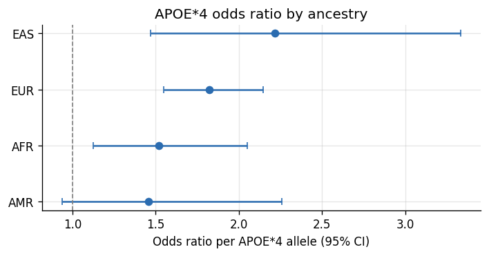
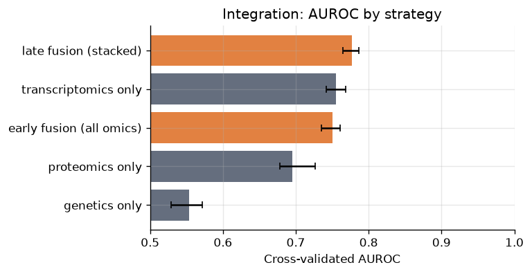
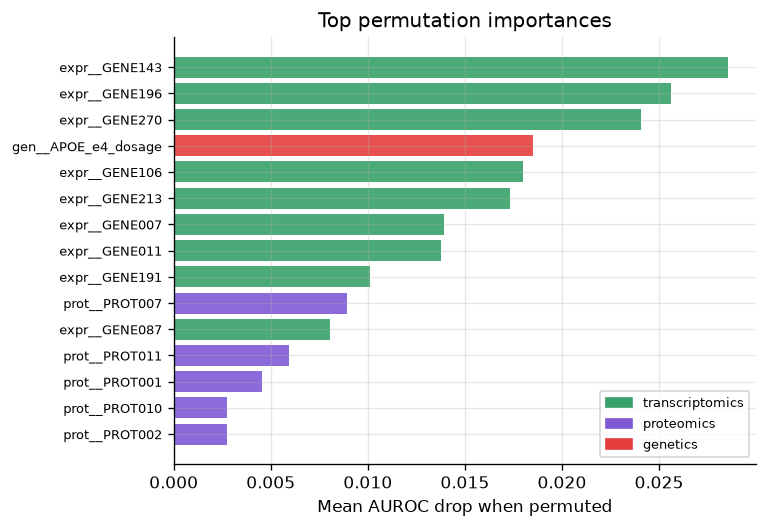

# AD Multi-Omics Toolkit (`admomics`)

**A reproducible, end-to-end pipeline for Alzheimer's disease genetics and multi-omics integration — GWAS → APOE×ancestry stratification → sex-stratified association → colocalization / Mendelian randomization → machine-learning multi-omics integration.**

This repository is a portfolio project built to demonstrate capability to work in research in population genetics, functional genomics, and multi-omics of Alzheimer's disease. It reproduces the *shape* of the core analyses used in this subfield on a fully simulated, planted-signal cohort, so the entire pipeline runs on any laptop with no access-restricted data. The GWAS causal-inference modules also wire up to **real, open-access public AD GWAS summary statistics**.

The analytical centerpiece is **machine-learning integration of multi-omic layers** — comparing early fusion, late fusion (stacking), and per-block models under leakage-safe cross-validation, then interpreting the result with block ablation, grouped permutation importance, and sex-stratified evaluation.

> **Data note.** Real AD cohorts (ADSP, ADNI, UK Biobank) are access-restricted. To keep this project fully reproducible, the cohort is *simulated with biologically-motivated planted signal*; the causal-inference modules additionally consume real public GWAS summary statistics (Bellenguez 2022, Wightman 2021). See [`docs/data_sources.md`](docs/data_sources.md). Every result below is produced by running the scripts in `scripts/`.

---

## Why these analyses

The pipeline is deliberately organized around the questions that define modern AD genetics:

| Module | Question | Method |
|---|---|---|
| `apoe` | Does the APOE\*4 effect vary by ancestry and sex? | Stratified logistic OR + ancestry×dosage interaction |
| `gwas` | Which variants associate with AD, adjusting for structure? | Covariate-adjusted logistic GWAS; sex-stratified heterogeneity |
| `coloc` | Does a GWAS hit share a causal variant with a molecular QTL? | Bayesian colocalization (approximate Bayes factors) |
| `mr` | Is a molecular exposure *causally* linked to AD? | Two-sample MR (IVW / Egger / weighted median) |
| `ml` | How do omic layers **combine** to predict AD, and what drives it? | Early/late fusion, ablation, grouped permutation importance |

---

## Headline results (reproduced by the scripts)

**1. APOE\*4 risk is ancestry-dependent** — the pipeline recovers the planted gradient (East Asian elevated, African attenuated relative to European), mirroring the shape of the ancestry-stratified APOE literature.



**2. Multi-omics integration beats any single layer, and late fusion wins.** Transcriptomics alone reaches AUROC ≈ 0.76; **stacked late fusion reaches ≈ 0.78** with tighter cross-fold CIs. Block ablation shows transcriptomics carries the most non-redundant signal.



**3. The model's importances recover ground truth.** Grouped permutation importance surfaces the *actual* simulated causal genes plus `APOE_e4_dosage` — evidence the integration is learning signal, not noise.



**4. Causal-inference modules behave correctly.** Colocalization returns `PP.H4 ≈ 1` when two traits share a causal variant and `PP.H3 ≈ 1` when they don't; MR recovers the planted causal log-OR (0.30 → IVW 0.32), while MR-Egger / weighted-median correctly flag a pleiotropic null case that naive IVW gets wrong.

---

## Quickstart

```bash
git clone <your-fork-url> && cd alz-multiomics-portfolio
python -m venv .venv && source .venv/bin/activate
pip install -e ".[dev]"

# run the whole pipeline (simulate -> APOE -> GWAS -> coloc/MR -> ML)
make all

# or step by step
python scripts/00_simulate.py
python scripts/01_apoe_stratification.py
python scripts/02_gwas.py
python scripts/03_coloc_mr.py
python scripts/04_ml_integration.py

# tests
pytest -q
```

To run coloc/MR against **real** public AD GWAS summary statistics:

```bash
python scripts/download_sumstats.py bellenguez2022   # open-access, no application
```

---

## Repository layout

```
src/admomics/         installable package (the reusable science)
  simulate.py         cohort generator with planted APOE / sex / ancestry signal
  sumstats.py         download + harmonize public GWAS summary statistics
  gwas.py             QC + covariate-adjusted logistic GWAS, sex stratification
  apoe.py             epsilon-genotype calling + stratified APOE risk
  coloc.py            Bayesian colocalization (approximate Bayes factors)
  mr.py               two-sample Mendelian randomization (IVW / Egger / median)
  integrate.py        subject × multi-omic feature-matrix assembly
  ml.py               cross-validated integration models + interpretation
  viz.py              publication-style figures
scripts/              runnable analyses that produce results/ and figures/
tests/                pytest suite: each module must recover its planted signal
docs/                 methods, data sources, and the background-bridge write-up
results/              generated tables + figures (committed for the portfolio view)
```

---

## Engineering practices demonstrated

- **Leakage-safe ML**: scaling/imputation fit *inside* each CV fold; stacked meta-learner uses out-of-fold base predictions only.
- **Reproducibility**: single RNG seed, pinned dependencies, installable package, deterministic simulation.
- **Validation as tests**: the test suite asserts that each method recovers known ground truth (APOE OR ordering, MR effect size, coloc hypothesis, integration > chance).
- **CI**: GitHub Actions runs the suite and a smoke pipeline on every push.

## License

MIT — see [`LICENSE`](LICENSE). All data are simulated or openly published; no restricted data are included.
